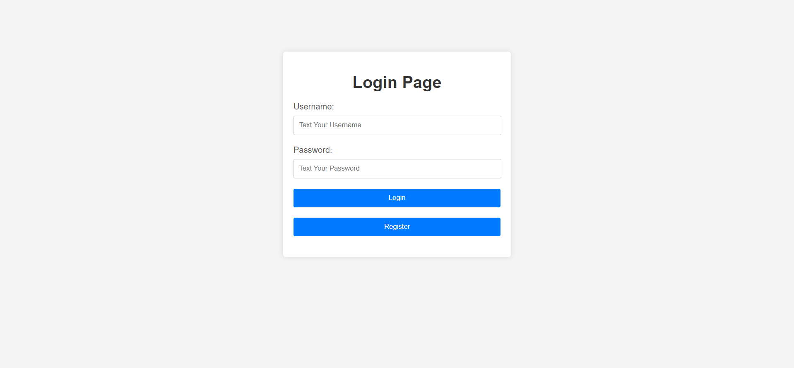
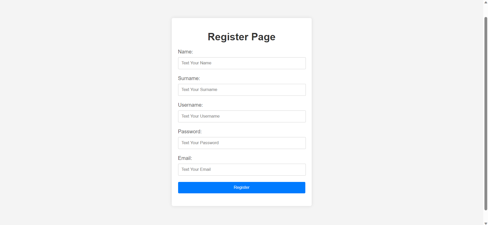
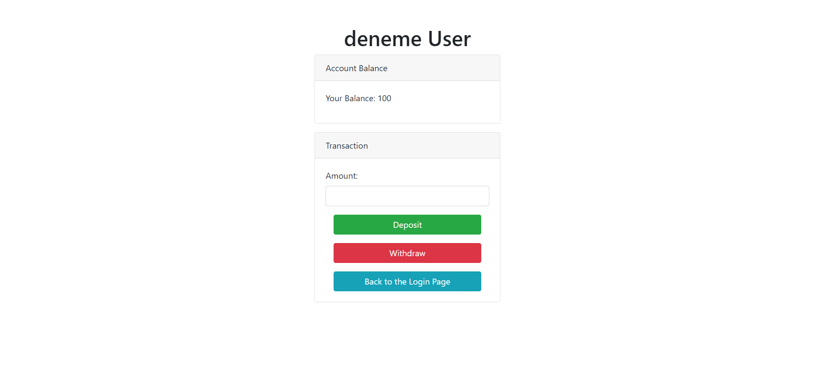
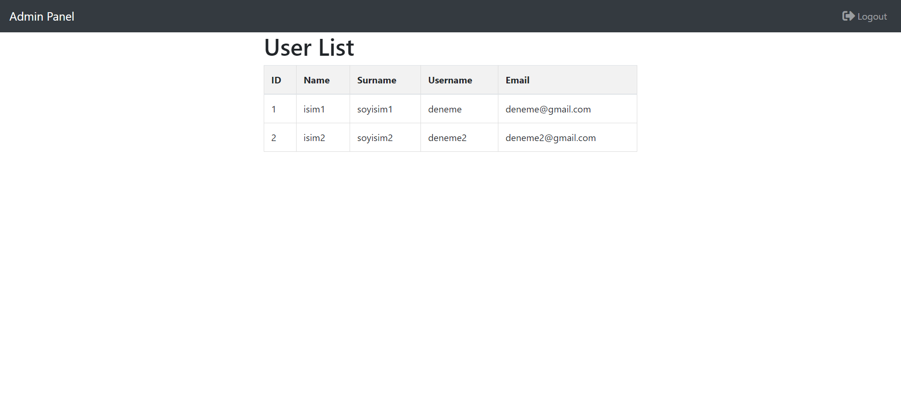

# LoginPageJspServlets
<table>
  <tr>
    <td></td> 
    <td></td>
   
  </tr>
  <tr>
    <td></td>
     <td></td>
  </tr>
  
 
</table>

Bu proje, Java programlama dili ve Servlet teknolojisi kullanılarak geliştirilmiş bir web uygulamasını içermektedir. Uygulama, kullanıcıların kayıt olabileceği ve ardından giriş yapabileceği ve banka işlemlerini yapabileceği  ve Admin paneli ile kişi bilgilerini tutabileceği basit bir sistem sunar. İşte projenin temel özellikleri:

## Özellikler

- Kullanıcı Kaydı (Register): Kullanıcılar, ad, soyad, e-posta ve şifre gibi temel bilgileri girerek kayıt olabilirler. Bu bilgiler veritabanında saklanır ve giriş yapabilmeleri için gereklidir.Bu işlem yapılır ve login sayfasına yönlendirilir.
- Kullanıcı Girişi (Login): Kayıtlı kullanıcılar, giriş yapabilmek için kullanıcı adı (e-posta) ve şifrelerini kullanabilirler. Giriş yapmayan kullanıcılar, özel alanlara erişim izni alamazlar ve uyarı mesajı alırlar.Ve sisteme giriş yapıldığında kullancı adı dinamik olarak çekilir ve gösterilir.
- Admin Panel : Admin kayıtlı kişilerin listesini görebililir müşterilerin isim soyisim kullanıcı adı değerlerine ulaşabilir para miktarı ve şifre değerlerine ulaşamaz.
- Veritabanı İletişimi: Proje, veritabanı işlemleri için Java Database Connectivity (JDBC) kullanır ve kullanıcı bilgilerini güvenli bir şekilde saklar.Bu projede MySQL database kullanılmıştır
- Kullanıcı Dostu Arayüz: Web sayfası kullanıcı dostu bir arayüze sahiptir ve kolayca gezinilebilir.Html,Css ve Bootstrap kullanılmıştır.

## Gereksinimler

- Java SE Development Kit (JDK): En azından Java 8 veya daha üst bir sürümü gerektirir.
- Servlet Container: Projenin çalıştırılabilmesi için bir Servlet konteyneri,Apache Tomcat kullanılabilir.
- Veritabanı: Kullanıcı bilgilerini saklamak için bir veritabanı sunucusu gereklidir. Bu projede MySQL kullanılmıştır.

## Kurulum

1. Projeyi GitHub'dan klonlayın:  ``  git clone https://github.com/AliTrgt/LoginPageJspServlets.git  ``
2. Proje klasörüne gidin:  ``  cd LoginPageJspServlets  ``
3. Veritabanını oluşturun ve ayarlarını yapılandırın.
4. Projeyi derleyin ve çalıştırın: ``  mvn clean install  ``
5. Tarayıcıda projenin ana sayfasını açın:  ``  http://localhost:8080/LoginPageJspServlets  ``

## Katkıda Bulunma

1. Bu repoyu "Fork" edin.
2. Yeni bir branch oluşturun (`git checkout -b yeni-ozellik`)
3. Değişikliklerinizi yapın ve bunları commit edin (`git commit -am 'Yeni özellik eklendi'`)
4. Dalınızı main'e pushlayın (`git push origin yeni-ozellik`)
5. Bir Pull Request oluşturun.

## Lisans

Bu proje MIT Lisansı altında lisanslanmıştır. Daha fazla bilgi için [LICENSE](LICENSE) dosyasını inceleyin.

---

